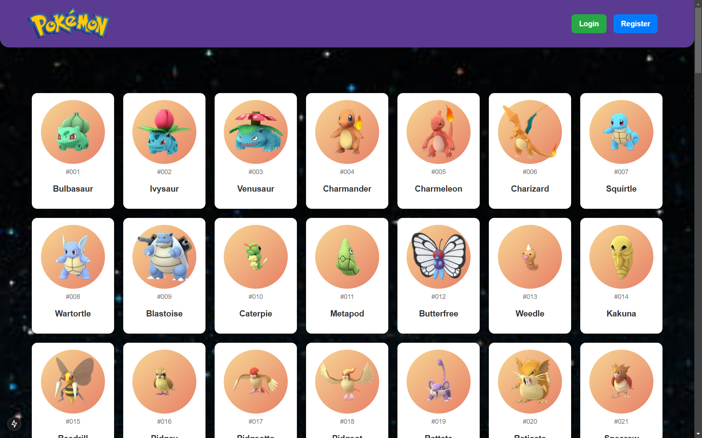
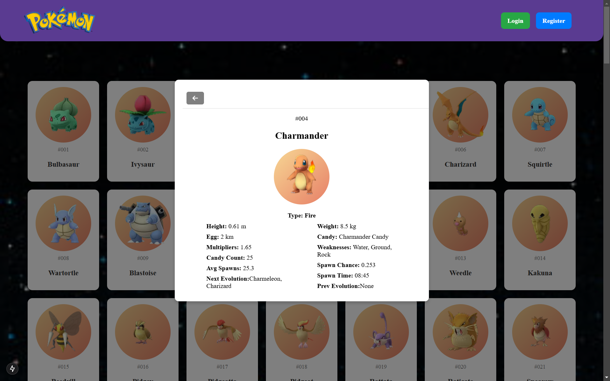
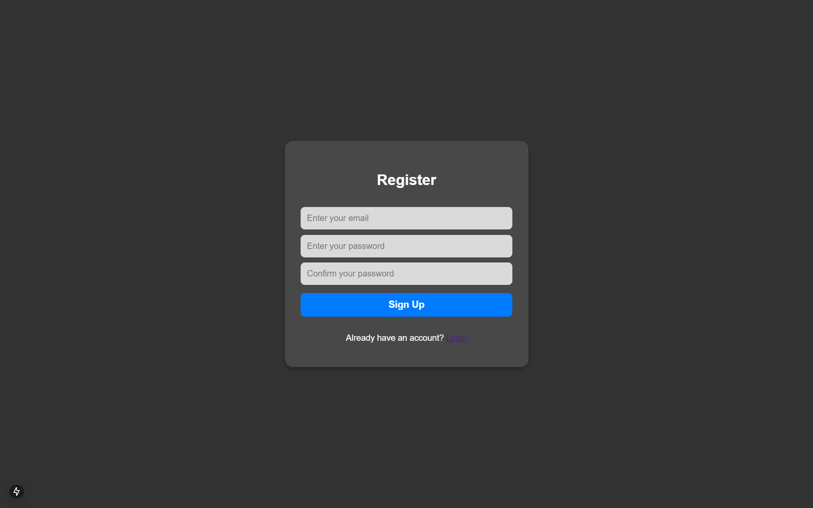
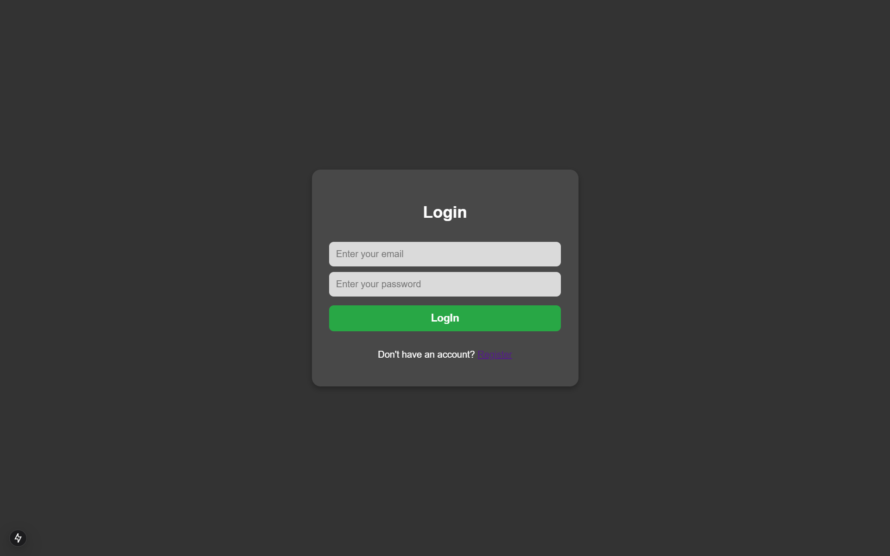
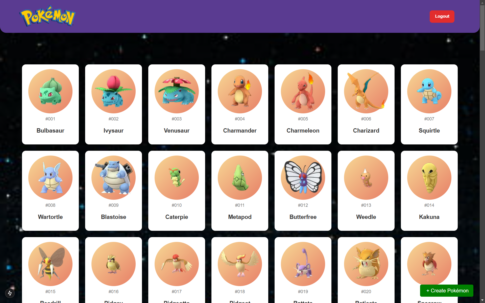
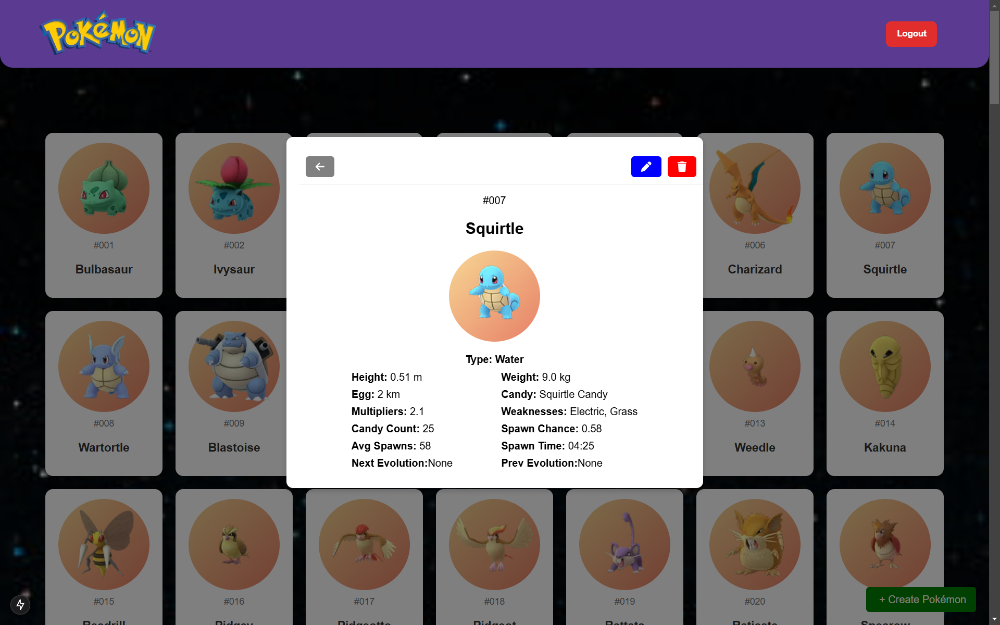
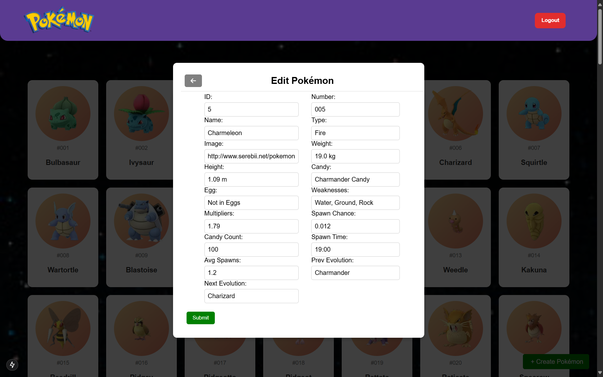
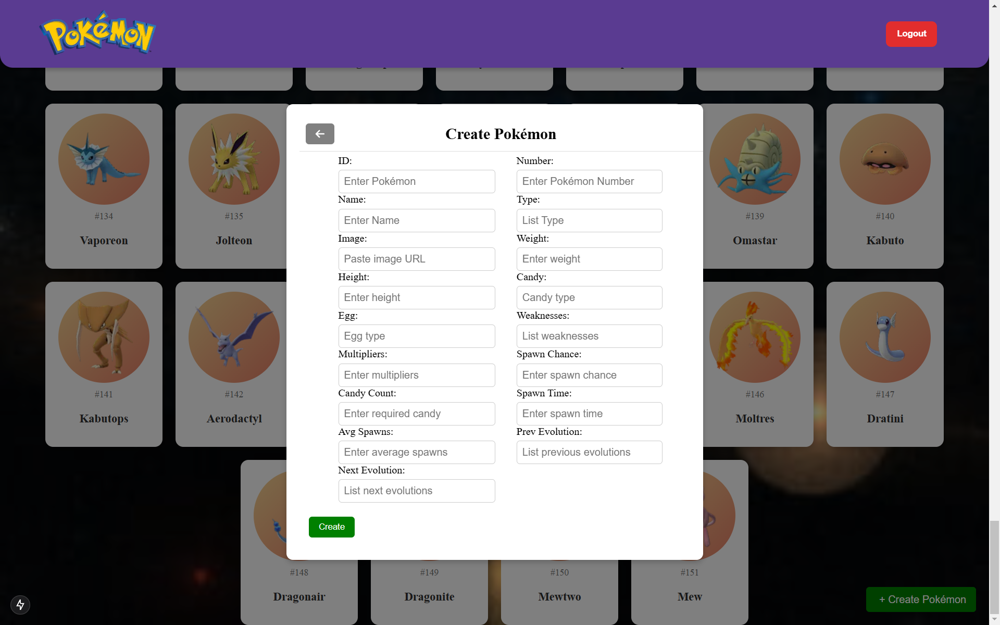

# Pokémon

## สวัสดีครับผมนายชุติพนธ์ สุดอ่อน จากคณะวิทยาศาสตร์เเละเทคโนโลยี สาขาวิทยาการคอมพิวเตอร์ มหาวิทยาลัยราชภัฎสงขลา
ซึ่งผมได้โจทย์มาว่า Problem Statement: สร้าง API CRUD สำหรับเว็บไซต์แสดงฐานข้อมูลโปเกมอน

-ไฟล์ฐานข้อมูลโปเกมอน pokemon-init-db.json

-ใช้ NodeJS ในการพัฒนาฝั่ง Backend ต้องการ API 4 เส้นในการทำ CRUD

- ดึงข้อมูลโปเกมอนทั้งหมดมาแสดง
- เพิ่มโปเกมอน
- แก้ไขข้อมูลโปเกมอน
- ลบโปเกมอน

- ใช้ Next ในการพัฒนาฝั่ง Frontend พร้อมระบบลงทะเบียนเพื่อเข้าใช้งานด้วย email และ password
- จัดการข้อมูลตาม API ที่สร้าง

**ขอให้ใช้ไฟล์ฐานข้อมูลให้มากที่สุด สามารถเลือก Database ได้ทั้ง SQL หรือ NoSQL

ซึ่งผมใช้เครื่องมือเหล่านี้ในการพัฒนาขึ้นมา

- ใช้ Vs code ในการพัฒนา

- ใช้ CSS ในการเขียนขึ้นมาเพราะเนื่องจาก TailwindCSS เครื่องผมมีปัญหาไม่สามารถใช้ได้

- ใช้ Postman ในการทดสอบ API

- ซึ่งผมได้เลือก MongoDB เป็นฐาน Database

***คำสั่ง Run server npm start
***คำสั่ง Run frontpage npm run dev

โดยจะมีเเต่ละหน้าที่ผมได้อธิบายไว้ว่าสามารถทำอะไรได้บ้าง

__________________________________________________________________________

### หน้า Home not login
หน้านี้จะเป็นหน้าเเรกเลยจะมีเเค่ปุ่ม register, login เเละ pokemon ซึ่งสามารถกดเข้าไปได้เลย การที่เราต้องการเพิ่มลบเเก้ไขข้อมูลใน Pokemon จะต้อง login ก่อน

__________________________________________________________________________

### หน้า Pokemon Detail
หน้านี้จะเป็นหน้าที่เเสดงรายละเอียดของ Pokemon เเต่ถ้า User ไม่ได้ login จะไม่สามารถเเก้ไขหรือลบได้จนกว่าจะ login

__________________________________________________________________________

__________________________________________________________________________

### หน้า Register
หน้านี้จะเป็นการสมัคร User เพื่อที่จะเข้าไปใช้งานเเละหน้านี้จะมี Already have an account? Login ซึ่งถ้ามีรหัสอยู่เเล้วสามารถกดตรง Login เพื่อที่จะย้ายไปหน้า Login

__________________________________________________________________________

__________________________________________________________________________

### หน้า Login
หน้านี้จะเป็นหน้าเอาไว้ให้ User login เพื่อที่จะใช้งานซึ่งหน้านี้ถ้าจะเข้าไปได้ต้องสมัครก่อนซึ่งจะมี Don't have an account? Register ถ้ากด Register จะไปยังหน้า Register

__________________________________________________________________________

__________________________________________________________________________

### หน้า Home Login Success
หน้านี้จะเป็นหน้าที่ User Login ผ่านเรียบร้อยเเล้วโดยจากปุ่มที่มี Login เเละ Register อยู่มุมบนขวาก็จะเปลี่ยนเป็น Logout เเทนเเละมีเเทบด้านล้างเป็น Create Pokémon เพื่อที่จะสามารถเพิ่ม Pokemon ได้

__________________________________________________________________________

### หน้า Pokemon Detail Login
หน้านี้จะเป็นหน้าที่ User Login ผ่านเรียบร้อยเเล้วโดยในหน้านี้จะมีการเเสดงรายละเอียดข้อมูลของ Pokemon เเละสามารถ Edit เเละ Delete ได้

__________________________________________________________________________

### หน้า Edit Pokemon
หน้านี้จะเป็นการให้เเก้ไขรายละเอียดข้อมูลของ Pokemon ซึ่ง ID ,Spawn Chance,Avg Spawn จะเป็นข้อมูลที่ต้องใส่เป็นตัวเลขข้อมูลเเละ Image ต้องใส่เป็น URL ยกตัวอย่างเช่น http://www.serebii.net/pokemongo/pokemon/001.png ภาพถึงจะขึ้นที่เหลือสามารถใส่เป็นข้อความได้หมดเลย

__________________________________________________________________________

### หน้า Create Pokemon
หน้านี้จะหน้าที่เพิ่มข้อมูล Pokemon ไปซึงสามาารถใส่ไม่ครบก็ได้เเต่ต้องใส่ให้ถูกเหมือนที่กล่าวในหน้าของ Edit Pokemon 

### ขอขอบคุณเป็นอย่างสูงในการพิจารณาผมหวังว่าผมมีจะมีโอกาสในการฝึกงานร่วมกับพี่ๆทุกคนๆนะครับขอขอบคุณอีกครั้งเเละสวัสดีครับ

